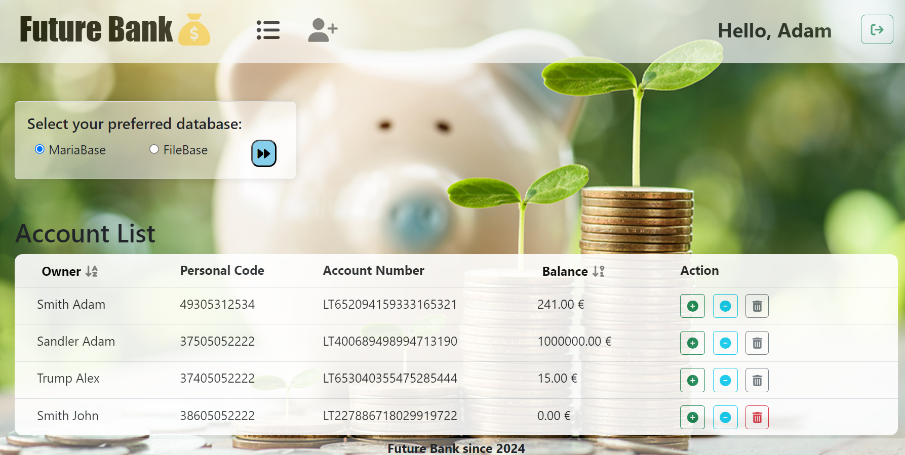

🌟 About This project:
 This application was for learning orpuses only. 

Site published at: https://laimalp.github.io/

🎯 Project features/goals

## Overview 

Bank CRUD Application

- This PHP-based Bank Application was created for learning and practicing CRUD operations. The main features include:
1. Login System:
    Secure login system to practice user authentication.
2. Bank Account List:
    Display a list of bank accounts for practice and understanding CRUD.
3. Admin Functions:
    Only logged-in administrators can access the account list and perform CRUD operations.
4. CRUD Operations:
    - Practice creating new bank accounts.
    - Learn to update account details.
    - Experience depositing and withdrawing funds from accounts.
5. Data Storage Options:
    - Choose between JSON file-based storage or MariaDB for storing bank account data.
    - Gain insights into the differences between file-based and relational database storage.

## Technology Used:

- PHP for server-side scripting.
- MySQL (MariaDB) for relational database storage.
- JSON for file-based storage.
- Object-Oriented Programming (OOP) principles for code organization.

## Deployment
1. Apache Server:
- Place the project in your Apache server's document root directory.
2. Virtual Host Setup:
- If you've created a virtual host, ensure it pairs the http://bank.test/ domain with the ROOT."/public" directory.
- If you haven't set up a virtual host, you can either create one or modify the code to fit your server configuration.
3. Credentials for CMS:
    - Use the default credentials to access the CMS:
        - Email adress: admin@gmail.com
        - Password: 123
